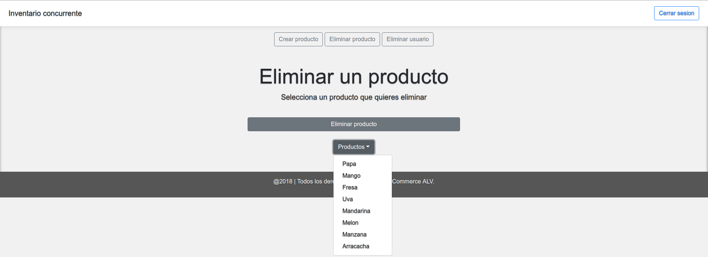

# Commerce project
 
 

## Miembros
- Johan Camilo López Girón
- Juan Manuel Villate Isaza
- Oscar David Alba Valencia

## Documento de arquitectura

### Introduccion
- Commerce ALV, un inventario concurrente el cual ofrece ventas de producto de la canasta familiar en tiempo real de manera proactiva, dinamica y segura, es una aplicacion la cual busca que la compra de productos de la canasta familiar que muchas veces tienen que ser comprados solo en almacenes de cadena y otras tiendas que ofrecen estos productos, sea de manera diferente, donde los usuarios de nuestra aplicacion se puedan convertir tanto en compradores como vendedores, donde personas que tengan sus propios productos a la venta los puedan ofrecer al precio que ellos quieran con el simple hecho de poner una oferta de venta sobre su producto y al cual diferentes usuarios que en este caso serian compradores pueden realizar ofertas para estos productos.
Cada uno de los usuarios de Commerce ALV esta correctamente verificado, donde queremos aseurar a todos nuestros usuarios que las personas con las que van a interactuar son de completa confianza, y que las operaciones de compra y venta que se realizen estan correctamente aseguradas y soportadas por todo nuestro equipo.
### Conceptos generales
- Spring: Todo
- Maven: Todo
- Heroku: Todo
- MongoDB: Todo
- Bootstrap: Todo
- Axios: Todo
### Implementacion
- Para esta aplicacion utilizamos el framework Spring el cual nos ofrece variedad de metodos e interfaces con las cuales podemos generar peticiones REST a una aplicacion web y ademmas podemos conectarnos a una base de datos NoSQL, en este caso usamos la base de datos MongoDB en la cual guardamos cada una de las entidades que usamos en este proyecto, en este caso las entidades que guardamos son producto, variedad del producto, admministrador, usuario y transaccion. Para cada una de estas entidades creamos sus respectivos modelos, servicios, persistencia y su respectiva implementacion y los controladores para realizar cada una de las peticiones REST que tendriamos que realizar dentro de la aplicacion web, para este caso utilizamos peticiones GET par obtener las entidades o informacion sobre ellas, peticion POST, la cual nos servia para crear una entidad con sus respectivos parametos, peticion DELETE la cual nos sirve para realizar acciones de administrador como lo seria eliminar algun tipo de producto o de usuario. El tipo de mensajes con la que se comunica la aplicacion web con los controladores son de tipo Json, por lo que esta implementacion de estos mensajes nos permite en un futuro hacer una extension de codigo o funcionalidades con bastante sencilles. Para la interfaz grafica de la aplicacion web utiliamos bootstrap el cual nos servia para desarrollar paginas para la aplicacion de manera amigable para el usuario y ademas paginas responsive design, para realizar acciones dentro de la aplicacion web utilizamos el lenguaje javascript, en el cual podiamos usar el lenguaje axios, el cual nos permite conectarnos al controlador desde la aplicacion web, con esta tecnologia se nos facilitaba realizar cada una de las peticiones REST que ya fueron mencionadas.
### Alcance
- Commerce ALV tiene como alcance la venta de productos en tiempo real, el registro de usuarios de manera correcta, antes de el registro se verifica que no exista un usuario con la misma cedula de un usuario que ya se haya registrado, permite la adicion de nuevos productos para la venta por parte de los usuarios que quieran vender, permite la busqueda de productos que estan a la venta por parte de un usuario que quiera realizar alguna compra. Por parte del administrador permite realizar una eliminacion de un producto, la creacion de un producto y ademas la eliminacion de un usuario registrado. Para las peticiones de creacion de algun tipo de entidad, estas peticiones cuando se realizan de manera correcta, autommaticamente se guarda la informacion en la base de datos que tenemos conectada a la aplicacion. Para las transacciones manejamos un id por cada transaccion para que un usuario la pueda consultar sus transacciones en cualquier momento, ademas, cada transaccion cuenta con las cediulas de los usuarios que realizaron la transaccio, esto para mantener la informacion en cada uno de los usuarios. Como se dijo anteriormente, el manejo de todos estos datos dentro de la aplicacion es mediante cadenas tipo Json, esto para facilitar el acceso de los datos y manejarse mediante un API propietaria que se crea para cada una de las entidades.
### Extensibilidad
- Como esta aplicacion maneja mensajes de las peticiones REST de tipo Json, la adicion de nuevos metodos, o union a nuevos programas o aplicaciones es muy sencilla, ya que cada una de las entidades de nuestra aplicacion cuenta con su API, la cual muestra cada una de las caracteristicas de las entidades. Para un futuro se quiere implementar el intercambio de productos entre dos usuarios diferentes.
Para el tema de seguridad se quiere implementar la seguridad que nos ofrece SpringBoot, la cual si un usuario no esta logueado correctamente no se le da acceso a las acciones que puede realizar un usuario, al igual a los administradores, si no esta logueado correctamente no se puede realizar las acciones sin sus permisos.
Para el tema del registro se quiere implementar la verificacion de datos personales mediante subida de archivos a la plataorma a la hora de registrarse, como cedula o soporte de direccion de residencia, esto para darle un plus de seguridad a nuestros usuarios y que las transacciones tengan un poco mas de seguridad.
### Pruebas
- Aplicacion desplegada en Heroku.

- Pagina de registro.

- Codigo Json del usuario registrado.

- Inicio de sesion para el usuario.

- Pagina unica para el usuario que ingresa

- Variedades de producto que se encuentran a la venta.

- Creacion de una nueva variedad de producto para la venta.

- Codigo Json de la variedad de producto creada.

- Inicio de sesion del administrador.

- Administrador puede crear un producto.

- Codigo Json del producto creado.

- Administrador puede eliminar un producto.

- Podemos observar que el producto arracacha ya no existe.

### Graficas
- Todo
### Conclusiones
- Para este proyecto utilizamos metodologia SCRUM con la cual nos organizamos de una manera la cual podiamos observar que debilidades y fortalezas teniamos cada uno de los integrantes y como las podiamos solucionar apoyandos entre nosotros, miramos tambien las entregas en 2 sprints para poder terminar la mayor parte del proyecto que se necesitaba.
Para desarrollar este proyecto utlizamos lenguajes y tecnologias como Spring, Java, Axios, MongoDB, Maven, git, entre otras, tecnologias y lenguajes que con la correcta implementacion y conexion entre cada una de ellas nos hacia mostrar y desarrollar un proyecto con grandes funcionalidades y con facilidad de extensibilidad ya que nuestro proyecto cuenta con comunicacion de datos Json los cuales permiten la obtencion de datos con facilidad y cada una de las clases y metodos cuentan con una correcta documentacion tanto en el back-end como en el front-end.
- Todas estas tecnologias que aprendimos y practicamos durante el curso de AREM son de mucha ayuda para nuestra ayuda profesional, ya que aparte de haberlas aplicado en la creacion de este proyecto las podemos en nuestra vida profesional o para agrandar nuestros conocimientos en el desarrollo de aplicaciones web, ya que comoe estas tecnologias existen muchas mas igual de fuertes o mucho mas fuertes, lo importante fue tener la claridad de cada uno de los concptos para lograr crear proyectos o aplicaciones de este tipo.
- Trabajar con metodologias agiles como en este caso fue SCRUM nos ayuda a trabajar en grupo, a aprender a ayudar a nuestros compañeros y a compartir conocimiento con nuestros demas compañeros, entender que el conocimiento bien aplicado entre todos los integrantes de un proyecto puede ser bastante provechoso que trabajar cada uno por su lado.
